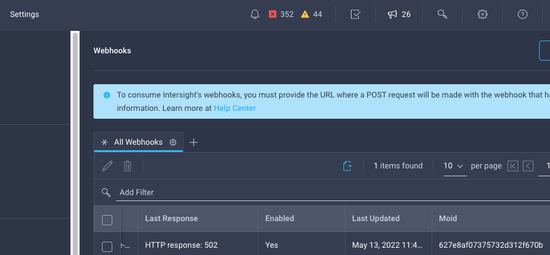

# intersight-python-utils/aws_lambda_webhook

AWS Lambda handler in Python for Intersight webhooks.

## Intersight Webhook Setup
Follow the instructions at https://intersight.com/help/saas/features/cisco_intersight/settings to configure Intersight webhooks.  You will need a publicly accessible webhook target URL, and the example code in this repository is using an AWS API Gateway as a webhook target.  When Intersight webhooks are received by the AWS API Gateway, an AWS Lambda handler is called to verify the webhook payload and write data to an AWS Timestream time series database.

## Code Overview
The intersight_alarms.py module has the following functions to process Intersight webhooks:
  - The verify_auth_header function verifies the Authorization Header sent by Intersight.  The header will be similar to the following: ```Authorization: Signature keyId="...", algorithm="hmac-sha256", headers="(request-target) host date digest content-type content-length", signature="..."```
    - The keyId in the header should match what Intersight reports as the webhook's Moid:
    
    - The signature in the header is a HMAC SHA256 signature computed from the headers listed by ```headers=...``` using the Secret configured for the webhook in Intersight.
    - The Intersight webhook keyId, host (Payload URL), and secret are retrieved by verify_auth_header using the following environment variables:
      - INTERSIGHT_WEBHOOK_KEY_ID
      - INTERSIGHT_WEBHOOK_URI
      - INTERSIGHT_WEBHOOK_SECRET
  - The lambda_handler function gets alarm information from the webhook's event body.  The code is specific to the cond.Alarm event type from Intersight, so other event types would need different code.  Alarm information is placed into an AWS Timestream record and written to the time series database.  Note that the code is meant as a reference only of processing webhook data - alarm information would not typically be used in a time series.
      
## Additional Information
- Video overview of configuring and testing webhooks: https://www.youtube.com/watch?v=lQ2AHAQ-uuQ&ab_channel=CiscoIntersight%2CHyperFlex%26UCS
- Intersight help pages on webhooks: https://intersight.com/help/saas/features/cisco_intersight/settings#configuring_webhooks
